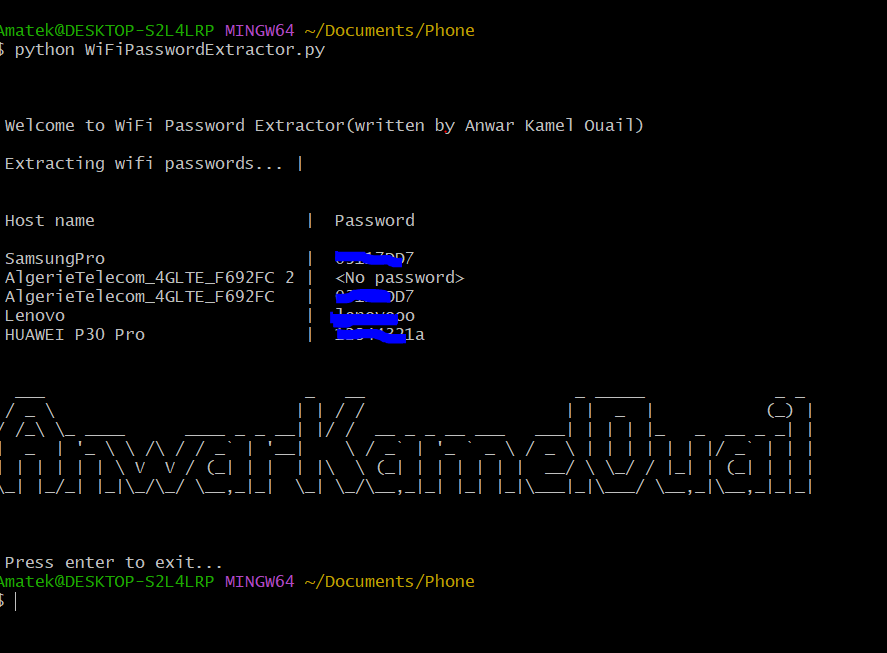

#  WiFi Password Extractor

## Introduction
Simple Python Script to extract WIFI Password saved in your  computer

## Technologies used:
* termcolor ( if not installed => use this command to install => pip3 install termcolor )
* itertools
* time
* subprocess

## uses :
* run the script WiFiPasswordExtractor by this command  : python WiFiPasswordExtractor.py

## Screen

